### **Custos is a SOS app for everybody but mainly for women.**

## The App Has Three Main Features.
### SOS/SAFE Buttons
- SOS button automatically calls & sends SMS to your primary contact which you chose plus fetching your current location and mark it as a danger zone.

- Safe button asks for your password to  check if it is actually you and send SMS to your contacts telling them you are safe

- Calling and sending SMS features are optional.

### Danger Zones
- Danger zones to inform people that this zone is not safe

### Tips
- Helpful tips for users and it can be saved.

# App UI
### - Login & Register Screens

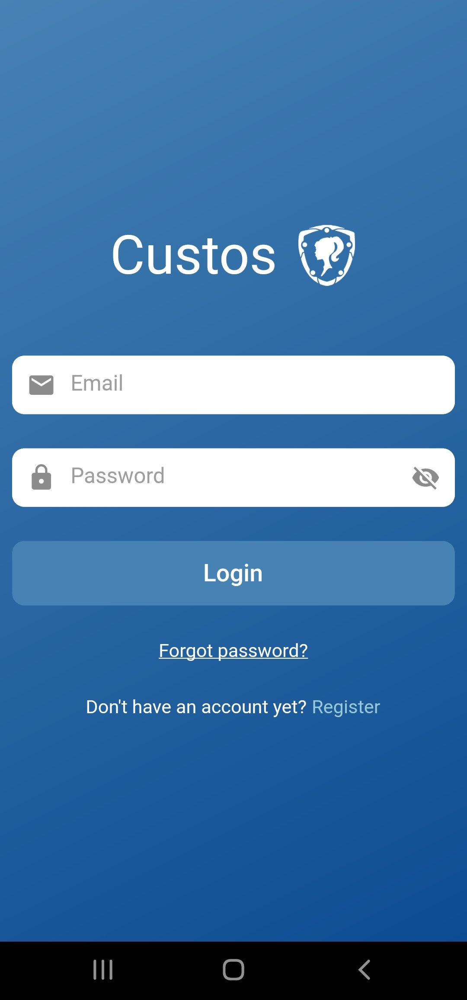 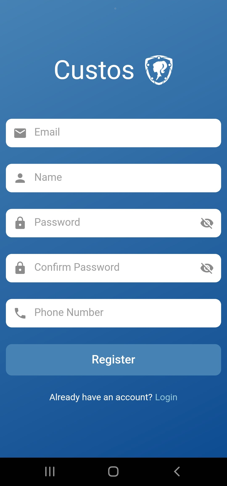

### - Walkthrough Screen

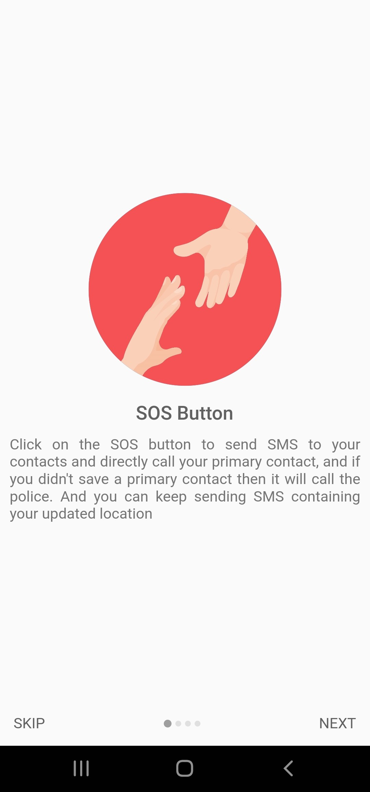 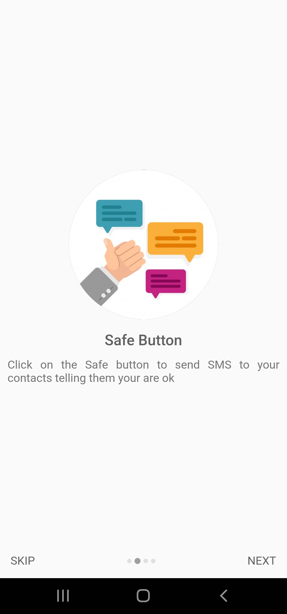 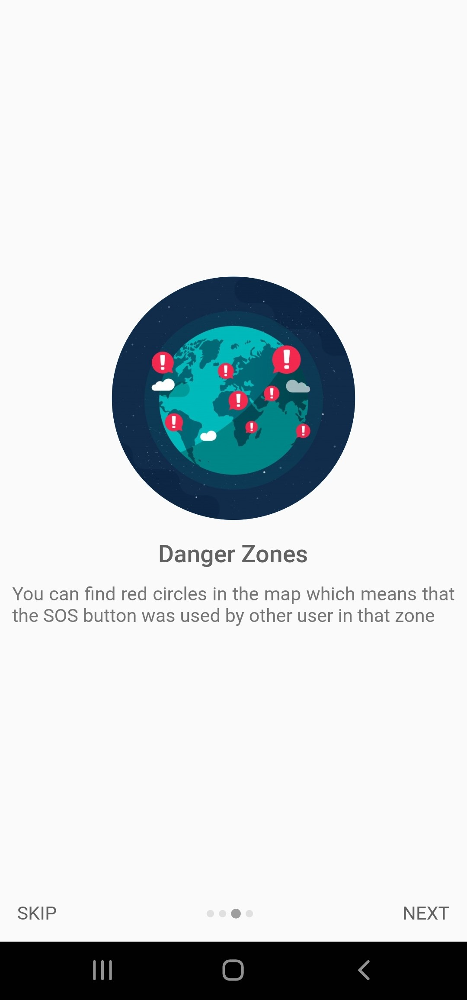 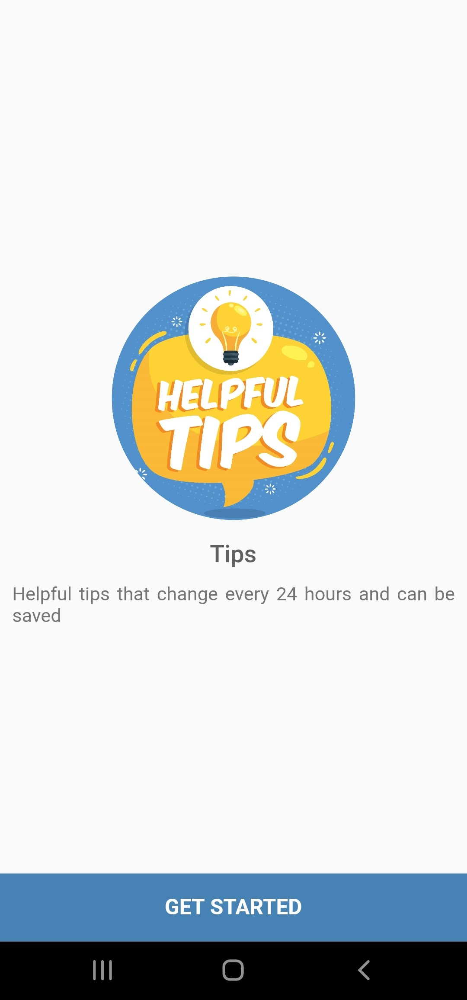

### - Home Screen (SOS & SAFE BUTTONS)

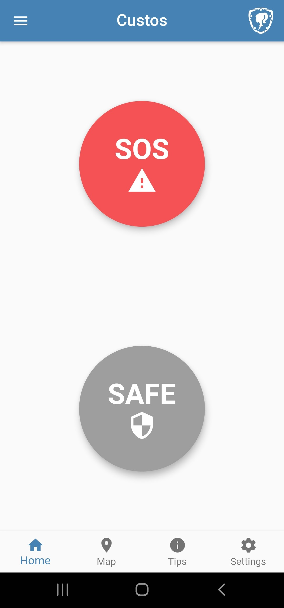 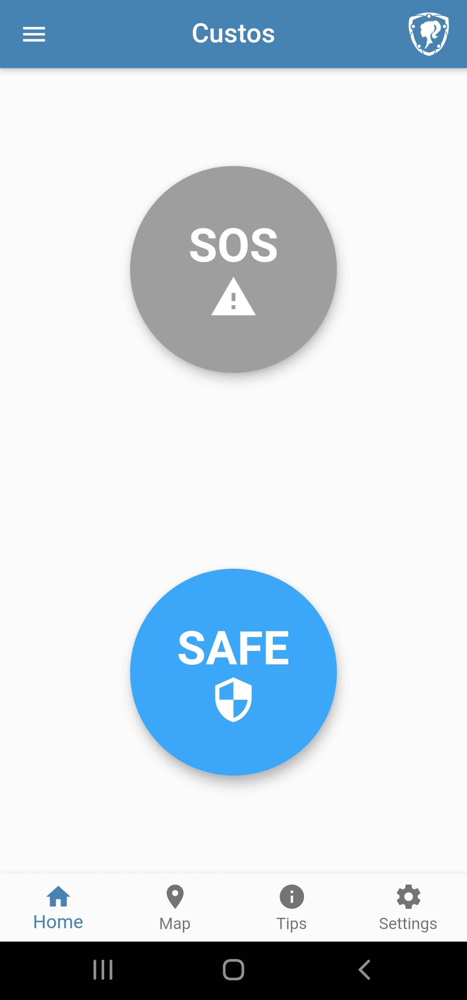 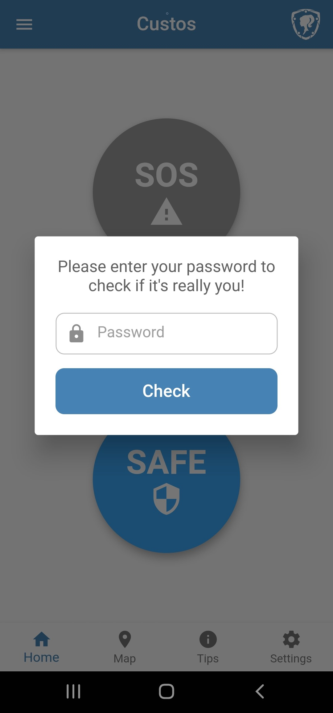

### - Map Screen (Danger Zones)

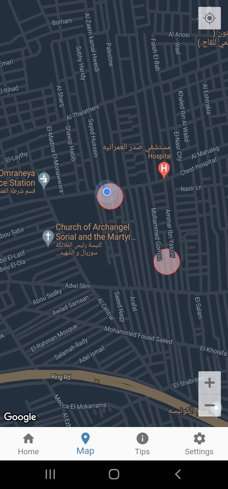

### - Tips & Saved Tips Screens

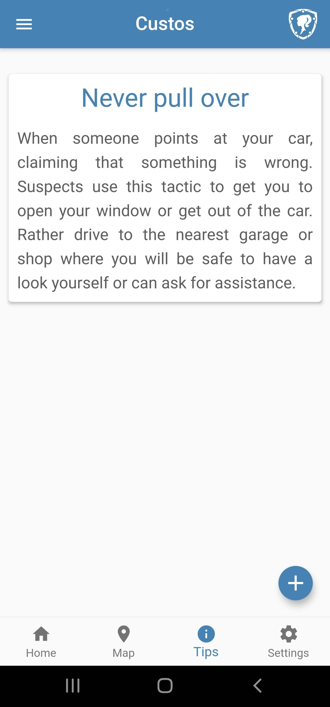 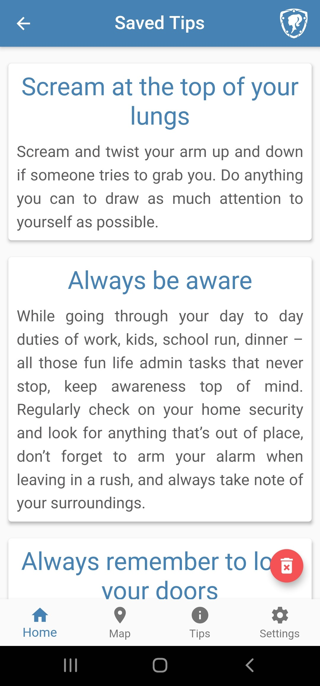

### - Settings Screen

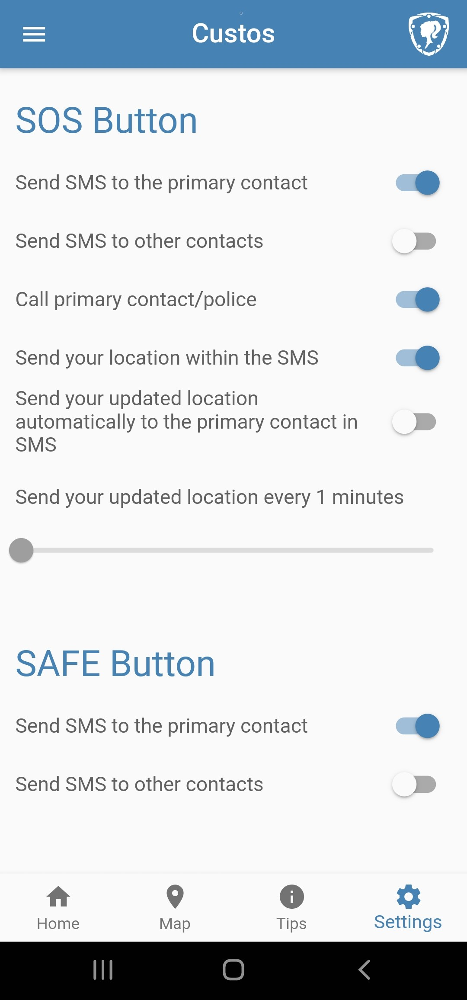

### - Contacts Screen

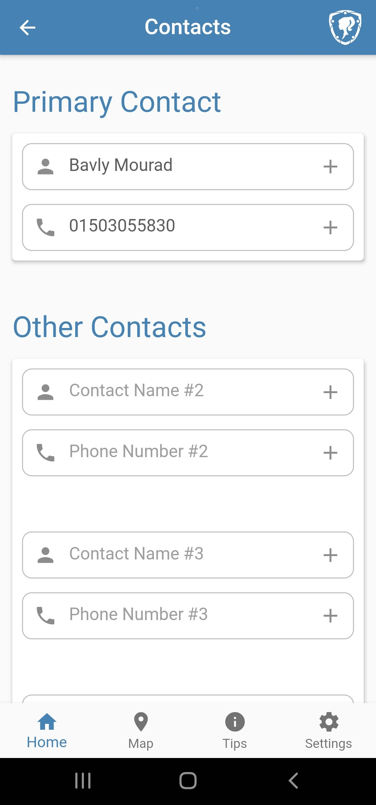

